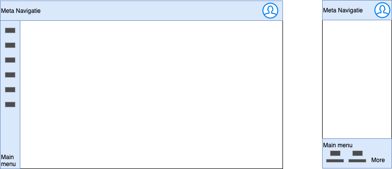

# Hoofdnavigatie

## Probleemstelling
Als je een basis structuur wil opzetten met navigatie kan je deze laatste op verschillende manieren weergeven. Afhankelijk van de soort, gaat het hier over een `content applicatie` voor marketing doeleinden of eerder een `functionele applicatie`? 

## Geschikt voor
Dit patroon is geschikt voor de meeste content websites en functionele applicaties. Het is niet verplicht maar wel aangeraden.

## Implementatie

### Metanavigatie
De eerste balk aan de bovenzijde van het scherm is voorbehouden voor de metanavigatie, waar we o.a. volgende zaken in terugvinden:

- logo
- taal switch
- applicatie level search
- contact info
- app switcher
- username en avatar van de aangemelde gebruiker

Deze metanavigatie gaat de consistentie tussen alle content en functionele applicaties verhogen. 

### Hoofdmenu
In het hoofdmenu kan je de applicatie-specifieke navigatie aanbrengen. We bekijken de 2 situaties.

#### Content applicaties

Content applicaties hebben een tweede horizontale balk die onder de meta navigatie staat. Menu items zijn horizontaal uitgelijnd naast elkaar. In mobile view staan alle menu items onder elkaar.

#### Functionele applicaties

Voor functionele applicaties staat het hoofdmenu links in desktop mode en onderaan in mobile mode. Je kan hier gebruik maken van iconen, die komen dan respectievelijk voor of boven de menu item tekst.

In desktop mode kan je een menu ook dichtklappen zodat enkel de icons over blijven.

