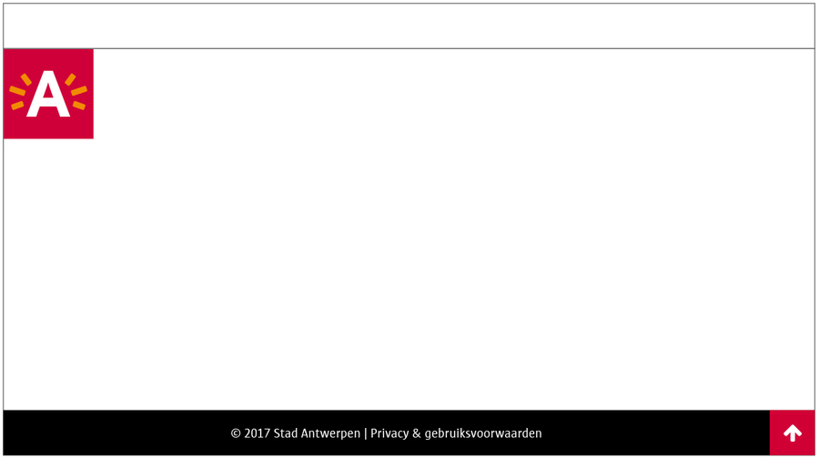

# Logo design pattern

## Probleemstelling

Waar plaatsen we het logo van de toepassing?

Mag het geplaatst worden in de metanavigatie?

Wat als er sprake is van een sub-brand?

## Zo te implementeren

De regelgeving omtrent het A-logo - al dan niet in combinatie met een descriptor of submerk-logo - en/of het 'Atypisch Antwerpen'-logo zijn terug te vinden [op deze pagina](https://www.antwerpen.be/nl/overzicht/merk-en-huisstijl-1/digitale-componenten/logo-s-bij-online-toepassingen).

Het A-logo staat altijd linksboven, onder de metanavigatie (balk van 48 pixels hoog). Op mobile toepassingen (phone/tablet) is het logo 72 x 72 pixels groot, op desktop 96 x 96 pixels.

Op tablet en desktop wordt het logo steeds naast de content van de pagina geplaatst. Meer info hierover [op deze pagina](https://www.antwerpen.be/nl/overzicht/merk-en-huisstijl-1/grid-voor-online-toepassingen/grid-voor-desktop-tablet-en-mobile).

Enige uitzondering op deze regel is een endorsement. Bij een endorsement - en enkel hier - kan het logo in de metanavigatie geplaatst worden. De grootte is dan steeds 48px. Meer info [op deze pagina](https://www.antwerpen.be/nl/overzicht/merk-en-huisstijl-1/merkarchitectuur/endorsement).
